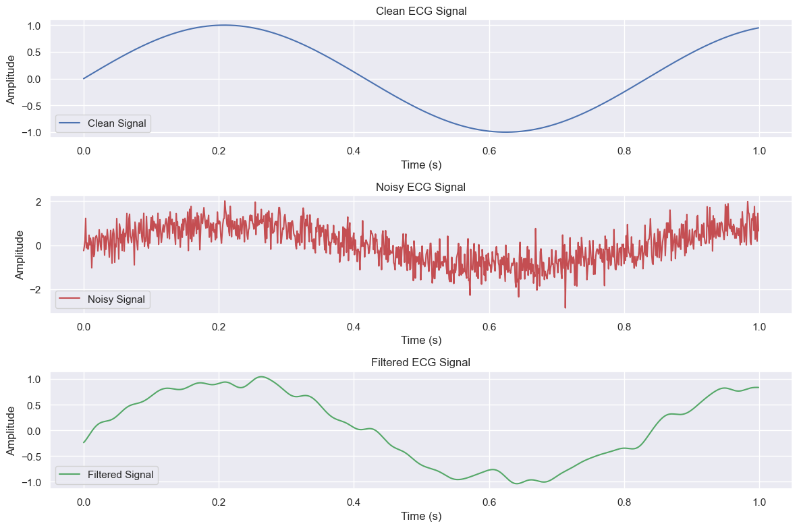

# ECG Signal Filter
A Python script to simulate and filter noise from an electrocardiogram (ECG) signal using a Butterworth low-pass filter. This project demonstrates signal processing for biomedical engineering applications, cleaning up noisy heart data to reveal the true signal.



## Features
- Generates a synthetic ECG signal with a heart rate of ~72 beats per minute (1.2 Hz).
- Adds random white noise to mimic real-world sensor interference.
- Applies a 4th-order Butterworth filter (20 Hz cutoff) to remove high-frequency noise.
- Plots three graphs: clean signal, noisy signal, and filtered signal.

## Prerequisites
- Python 3.x
- Required libraries: `numpy`, `scipy`, `matplotlib` (listed in `requirements.txt`)

## Installation
1. Clone the repo:  
   ```bash
   git clone https://github.com/Arian4ever/ECG-Signal-Filter.git

2. Install dependencies:
   ```bash
   pip install -r requirements.txt

## Usage
- Run the script to see the filtering in action:
  ```bash
  python ecg_filter.py

## Application

Perfect for learning signal processing in biomedical engineering—think ECG devices, heart monitors, or any system needing clean bio-signals.

Built by Arian4ever with assistance from Grok 3 by xAI.
